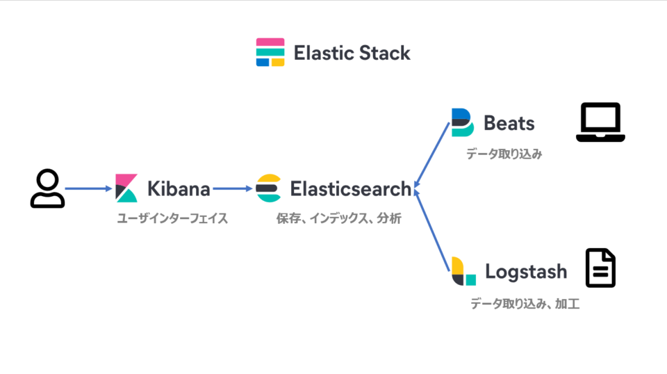

# Elastic Stackの導入

## 目次
- [Elastic Stackとは](#elastic-stackとは)
- [Elastic Stackの構築](#elastic-stackの構築)
    - [javaのインストール](#javaのインストール)
    - [Elasticsearchのインストール](#elasticsearchのインストール)
    - [Kibanaのインストール](#kibanaのインストール)
    - [Kibana-Elasticsearch接続確認](#kibana-elasticsearch接続確認)
    - [Logstashのインストール](#logstashのインストール)
    - [Beatsのインストール](#beatsのインストール)
- [ログ分析に向けて](#ログ分析に向けて)
    - [logstash.confの設定](#logstashconfの設定)
    - [inputプラグインの設定](#inputプラグインの設定)
    - [outputプラグインの設定](#outputプラグインの設定)
    - [filterプラグインの設定](#filterプラグインの設定)
    - [ログ送信の実行](#ログ送信の実行)
- [筆者がハマったところ](#筆者がハマったところ)
    - [logstash.confが正しく書けているのに動作しない](#logstashconfが正しく書けているのに動作しない)

## Elastic Stackとは
OSS(Open-source Software)ベースの以下プロダクト群をElasticStackと呼びます(以前はELKと呼んでいた)．  
- Elasticsearch：データの保存・検索・分析
- Kibana：データの可視化，Elasticstackの設定・管理GUI
- Logstash：データ入力・変換，Elasticsearchへの出力
- Beats：各種データ収集，Logstash，Elasticsearchへのデータ出力

関係性を一枚のイメージにまとめた図が以下の通りです．

Elastic Stackの役割は，Syslogサーバーに保存されているログファイルを取得してLogstashでパース，Elasticsearchに取り込み，Kibanaで可視化したり，csvファイルに出力させてSQLサーバーに取りこむことです．

詳しくは[Elastic](https://www.elastic.co/jp/)のサイトへ．

[TOP に戻る](#目次)

[HOME に戻る](../README.md)


## Elastic Stackの構築
以下にElastic Stackの構築法を記します．  
但し，Windows環境であることに注意してください．

### javaのインストール
LogstashやElasticsearchのインストールに必要であるjavaをインストールします．  
詳しくは[環境構築](../env/README.md#javaのインストール)を確認してください．

### Elasticsearchのインストール
zipファイルを[公式サイト](https://www.elastic.co/jp/downloads/elasticsearch)よりダウンロードします．  
その後解凍し，任意の場所へ展開します．

展開したファイル内で`bin`配下にある`elasticsearch.bat`を実行するとプログラムが動作し，Elasticsearchが立ち上がります．  
確認としてコマンドプロンプト上で
```bash
curl localhost:9200
```
を入力し，JSON形式でレスポンスが返ってくれば完了です．  

但し，筆者の端末上では
```bash
curl: (52) Empty reply from server
```
とエラーが吐き出されていました．  
恐らく暗号化されていない平文のHTTPトラフィックが受信され，接続が閉じられたことが原因と思われます．  
この解決方法としては，初回実行後`./config/elasticsearch.yml`内に記述されている`xpack.security.enabled`の値を`false`とすることです．  
このようにすることでJSON形式でレスポンスが返ってくるはずです．


[TOP に戻る](#目次)

[HOME に戻る](../README.md)

### Kibanaのインストール
Kibanaのインストール手順もElasticsearchのインストールとほぼ同様の手順で行うことができます．  
zipファイルを[公式サイト](https://www.elastic.co/jp/downloads/kibana)よりダウンロードし，解凍・展開します． 

展開したファイル内で`bin`配下にある`kibana.bat`を実行すると起動します．  
その後ブラウザで`http://localhost:5601`に接続し，GUIが表示されれば完了です．

### Kibana-Elasticsearch接続確認
KibanaからElasticsearchに接続できているかの確認を行うことができます．  
先ほどブラウザで開いたKibanaの左側にあるサイドバーに`Dev Tools`があるので，そこに移動します．  
するとコンソール画面が出てくるため，そこで以下の入力を行った後に再生ボタンを押下します．  
```bash
GET /
```

先ほどのJSON形式のレスポンスが右画面に出力されれば，Kibana→Elasticsearchの接続も完了です．

[TOP に戻る](#目次)

[HOME に戻る](../README.md)

### Logstashのインストール
Logstashのインストール手順もほぼ同様の手順で行うことができます．  
zipファイルを[公式サイト](https://www.elastic.co/jp/downloads/logstash)よりダウンロードし，解凍・展開します．  

#### Logstash起動前の設定項目
`bin/logstash.bat`の実行前に，`logstash-8.10.2`配下に`logstash.conf`を作成する必要があります．  
まずは動作確認用に次のコードを`logstash.conf`に記述します．  
```bash
# 標準入力を受け付ける
input {
  stdin { }
}
# 標準出力を行う
output {
  stdout { codec => rubydebug }
}
```

#### Logstashの起動・動作確認
`bin`配下にある`logstash.bat`を実行して，Logstashを起動します．  
この際，`logstash-8.10.2`配下でコマンドプロンプトを起動し，次のコマンドで実行してください．
```bash
bin\logstash.bat -f logstash.conf
```
`logstash.conf`にタイプミス等なければ，実行結果に`The stdin plugin is now waiting for input:`が出力されます．  
コマンドプロンプトに任意の文字列を打ち込むと，そのまま返り値として出力されるはずです．  

実行例
```bash
# 入力
hello world
# 出力
{
    "@timestamp" => 2023-10-02T10:35:30.889064200Z,
          "host" => {
        "hostname" => "DESKTOP-01NBJ48"
    },
         "event" => {
        "original" => "hello world\r"
    },
       "message" => "hello world\r",
      "@version" => "1"
}
```

[TOP に戻る](#目次)

[HOME に戻る](../README.md)

### Beatsのインストール
Beatsのインストールは，インストール時のトラブルの際にBeatsに問題があるのかを切り分けるのが難しいため，Elastic Stackが正しく起動できた後に行います．  
今回はMetricbeatのインストール方法を例に挙げて紹介します．  

Beatsのインストール手順もほぼ同様の手順で行うことができます．  
zipファイルを[公式サイト](https://www.elastic.co/jp/downloads/beats/metricbeat)よりダウンロードし，解凍・展開します．  
最後に，Admin権限でPowerShellを起動し，`metricbeat-8.10.2-windows-x86_64`配下で次のコマンドを入力します．
```bash
.\install-service-metricbeat.ps1
```
但し，この実行の際に，
```bash
.\install-service-metricbeat.ps1 : このシステムではスクリプトの実行が無効になっているため、ファイル C:\metricbeat-8.10.
2-windows-x86_64\install-service-metricbeat.ps1 を読み込むことができません。詳細については、「about_Execution_Policies
」(https://go.microsoft.com/fwlink/?LinkID=135170) を参照してください。
発生場所 行:1 文字:1
+ .\install-service-metricbeat.ps1
+ ~~~~~~~~~~~~~~~~~~~~~~~~~~~~~~~~
    + CategoryInfo          : セキュリティ エラー: (: ) []、PSSecurityException
    + FullyQualifiedErrorId : UnauthorizedAccess
```
とエラーが出る場合があります．  
この際は，以下のコードでセキュリティポリシーを変更してから実行してください．
```bash
Set-ExecutionPolicy Unrestricted -Scope Process
```
これにより，インターネットからダウンロードしたファイルを実行する場合は警告が表示されるものの実行は可能になります．  

実行した後は
```bash
Set-ExecutionPolicy Restricted -Scope Process
```
で元に戻しておきましょう．

#### Metricbeatのセットアップ
Metricbeatは基本的にインストールするだけでプロセスごとのCPU 使用率・メモリ使用率を収集できます．  
---  以下，工事中   ---


[TOP に戻る](#目次)

[HOME に戻る](../README.md)

## ログ分析に向けて
以下，Logstashを用いてデータ取得・加工し，Elasticsearchへ送付する方法を記します．

### logstash.confの設定
logstash.confはinput、filter、outputの3つに分かれています．動作確認時に少し記載しましたが，この章では本格的にlogstash.confを記載します．  
logstash.confの記載を変更する場合，念のためLogstashサービスを停止しておきましょう．

#### input
inputはログをどこから取得するか決める部分です．  
Logstashサービス再開時の挙動を指定することも可能です．

#### filter
filterはログをどのように加工・整形するかを決める部分です．

#### output
outputはログをどこに送るのかを指定する部分です．  
Elasticsearchへのデータ送付以外にもCSV形式など指定した拡張子でデータを出力することも可能です．

### inputプラグインの設定
input部分では情報の取得元ごとにプラグインが提供されています．  
今回はファイルを取得するため，fileプラグインを使います．  
利用できるプラグインの種類は[公式サイト](https://www.elastic.co/guide/en/logstash/5.4/input-plugins.html)で確認できます．  

inputプラグインの記載例
```bash
input{
    file{
        path => "\\フォルダのフルパス\\logs\\**.log"
    }
}
```
logstash.confの記載はJSON形式で行います．  
fileプラグインではpathが必須項目にあたり，`path => file's_path`のように指定します．  
パスの指定には正規表現を利用できますが，フルパスで記載する必要があります．

#### ファイルの読み込み位置を指定する
デフォルトの設定では，起動した後に更新された分だけファイルを読み取る設定になっているため，ファイルの読み込み位置を指定する必要があります．

どこまでファイルを読み取ったかは，Logstashが自動で`sincedb`というファイルに記録しています．  
設定を変更することで`sincedb`ファイルに記録されている履歴の次から情報を取得できます．  
ファイルの読み込み位置は`start_position`を用いて設定します．

`start_position`の設定
```bash
# Logstash起動後に追加されたログのみ取り込む場合（デフォルト）
start_position => "end"

# Logstashが停止後に追加されたログも取り込む場合
start_position => "beginning"
```

`start_position`を指定した`logsatsh.conf`
```bash
input{
    file{
        path => "\\フォルダのフルパス\\logs\\**.log"
        start_position => "beginning"
    }
}
```

#### ファイルにタグをつけて分類する
読み込んだデータを分類したい場合，自分でタグ(tags)をつけることができます．  
`tags`を利用すると，if文などを用いて取り込んだデータに対する固定の処理を指定できます．  
Kibanaのグラフ作成の際に`tags`を指定すると，1つの情報のまとまりごとにデータを分類するグラフを作成できます．  
`tags => "好きな名前"`または`tags => ["好きな名前1", "好きな名前2", ...]`で指定します．

タグの例
```bash
input{
    file{
        path => "\\フォルダのフルパス\\logs\\**.log"
        start_position => "beginning"
        tags => "log_data"
    }
}
```

#### 取り込み対象以外のファイルを除外する
zipファイルなど取り込み対象から除外したものがある場合，`exclude`を利用することでLogstashの取り込み対象外のファイルを指定できます．  
こちらはパス指定は不要で，正規表現を用いて指定できます．

指定例(kobeから始まるtxtファイルを除外)
```bash
input{
    file{
        path => "\\フォルダのフルパス\\logs\\**.log"
        start_position => "beginning"
        tags => "log_data"
        exclude => "kobe*.txt"
    }
}
```

[TOP に戻る](#目次)

[HOME に戻る](../README.md)

### outputプラグインの設定
Kibana上でグラフを作成するためにはElasticsearchにデータが入っている必要があります．  
outputプラグインを用いてデータの送付先を指定しましょう．

#### Elasticsearchにデータを送る
Elasticsearchにログを送付するにはelasticsearchプラグインを利用します．  
Elasticsearchのホスト名を指定しない場合，`localhost:9200`にアクセスします．  
URLを明示的に設定するためには`hosts`を利用します．  

elasticsearchプラグインの指定例(ElasticsearchのURLが10.0.0.100の場合)
```bash
output{
    elasticsearch{
        hosts => "http://10.0.0.100:9200"
    }
}
```

#### 送付先indexの指定
Elasticsearchはデータの持ち方が`field`に対する`text`という構造になっています．  
`field`とは，データベースでのカラムに相当し，`text`はカラム内に入っている実データです．  
カラム内にデータを入れるように，`field`内に実際のデータ(`text`)を保持します．  
このデータの集合を`index`といいます．  
`field`の集合をドキュメントといい，1件分のデータに相当します．

デフォルトのindex名は`logstash-%{+YYYY.MM.dd}`です．  
elasticseachプラグインの`index`を用いることでindex名を変更できます．  
1つのElasticsearchに種類の異なるデータを集める場合，データを保存する`index`を明示的に指定し保存すると，`index`とデータの内容を紐づけられるため，データの管理・運用を楽にすることができます．

index名の変更例
```bash
output{
    elasticsearch{
        hosts => "http://10.0.0.100:9200"
        # hosts => ["http://localhost:9200"]でも可
        index => "%{[some_field][sub_field]}-%{+YYYY.MM.dd}"
    }
}
```

他のプラグインを利用することでデータをファイルに出力することも可能です．  
利用可能なプラグインは[公式サイト](https://www.elastic.co/guide/en/logstash/current/output-plugins.html)に一覧があります．

[TOP に戻る](#目次)

[HOME に戻る](../README.md)


### filterプラグインの設定
今までの記述を踏まえると，以下のようなconfファイルになるはずです．
```bash
input{
    file{
        path => "\\フォルダのフルパス\\logs\\**.log"
        start_position => "beginning"
        tags => "log_data"
        exclude => "kobe*.txt"
    }
}
output{
    elasticsearch{
        hosts => "http://10.0.0.100:9200"
        index => "%{[some_field][sub_field]}-%{+YYYY.MM.dd}"
    }
}
```
ただし，このままではログは次のようにElasticsearchへ連携されます．
```bash
{
    "path" => "\\フォルダのフルパス\\logs\\**.log",
    "@timestamp" => 2023-10-01T08:00:00.000Z,
    "@version" => "1",
    "host" => "XX.local",
    "message" => "\"730751058306162689\",\"160512 222643\",\"お腹空いた\"",
    "tags" => [[0] "log_data"]
}
```
これをこのままKibanaで可視化するのは，field名"host"ではホスト名が丸見えのため抵抗があります．  
サーバのホスト名ならまだしも，個人PCで起動している場合，自分んおPC情報がKibanaで閲覧できてしまいます．  

さらに，`@timestamp`はUTC時間で出力されており，ログの出力時刻はLogstashにデータが連携された時間となっています．  
このままではログが出力された本当の時刻と，messageの分割された状態のログが取得できません．

そこで，filterプラグインを用いてログの中身を整形する必要があります．  
プラグインの一覧は[公式サイト](https://www.elastic.co/guide/en/logstash/current/filter-plugins.html)にまとめられているので，扱うデータに合わせて使用プラグインを変更しましょう．  

また，filterプラグインは記述した順番に処理が行われます．  
ログの加工順序を考えつつ，filterプラグインを記載するとよいでしょう．  

#### filterプラグインの多重使用
ログの形式によっては，様々なfilterプラグインが一度に使用する必要がある場合があります．  
その場合，ログを分割した後にその分割したものにさらにfilterプラグインを適用することができます．

以下，次のログデータが得られると仮定して説明します．
```bash
<134>1 2023-05-31T14:59:59Z exampledb CheckPoint 10000 - [action:"Accept"; conn_direction:"Internal"; flags:"0000000"; ifdir:"inbound"; ifname:"eth2"; logid:"0"; loguid:"{aaaaaaaaaa,bbbbbbbbbb,cccccccccc,dddddddddd}"; origin:"192.168.111.222"; originsicname:"CN=example-1,O=exampledb..x7osv4"; sequencenum:"255"; time:"1685545199"; version:"5"; __policy_id_tag:"product=VPN-1 & FireWall-1[db_tag={AAAAAAAA-BBBB-CCCC-DDDD-EEEEEEEEEEEE};mgmt=exampledb;date=1683875804;policy_name=Standard\]"; dst:"192.168.04.10"; lastupdatetime:"1685545199"; log_delay:"1685545199"; layer_name:"Network"; layer_uuid:"aaaaaaaa-bbbb-0000-cccc-dddddddddddd"; match_id:"43"; parent_rule:"0"; rule_action:"Accept"; rule_uid:"xxxxxxxx-xxxx-xxxx-xxxx-xxxxxxxxxxxx"; nat_addtnl_rulenum:"0"; nat_rule_uid:"XXXXXXXX-XXXX-XXXX-XXXX-XXXXXXXXXXXX"; nat_rulenum:"1"; product:"VPN-1 & FireWall-1"; proto:"17"; s_port:"56160"; service:"53"; service_id:"domain-udp"; src:"192.168.101.111"]
```
これはSyslogログ(IETF形式)の一例です．  

これをまずgrokfilterを使用してparseします(__grokパターンの生成はElasticsearchでのログ収集にあたり不可欠であるにもかかわらず，Logstashを利用する上で最難関のconfigであることをここに注意しておく__)．  

よく見てみると，初めにタイムスタンプ等がきて，"[~~]"で囲まれ，key:value形式で表されたmessage部がきていることがわかるため，message部とそれ以外の部分で分けてみることにします．

grokfilterの適用例
<!-- ```bash
filter {
    grok {
        match => { "message" => "<%{POSINT:syslog_pri}> %{TIMESTAMP_ISO8601:timestamp} %{DATA:hostname} %{WORD:app_name} %{INT:event_id} - \[%{GREEDYDATA:rest}\]
    }
}
``` -->
```bash
filter {
    grok {
        match => { 
            "PRI" => "<%{POSINT:syslog_pri}>%{INT:version} %{GREEDYDATA:HEADER}"
        }
    }
    grok {
        match => {
            "HEADER" => "%{TIMESTAMP_ISO8601:timestamp} %{DATA:hostname} %{WORD:app_name} %{INT:process_id} - \[%{GREEDYDATA:rest}\]"
        }
    }
}
```
ここで，各要素に与えられているall capsの英数字(`TIMESTAMP`等)は，使用できるものが[公式githubリポジトリ](https://github.com/hpcugent/logstash-patterns/blob/master/files/grok-patterns)に公開されているので，要確認です．ここに定義されているgrokパターン以外の表現に対してparseをかけたい場合は，自分で正規表現を作成する必要があります．  
最後に出現している`GREEDYDATA`という定義はあらゆる文字列を無差別にマッチさせるものであり，一つ目のgrokfilterではこれに`HEADER`というタグをつけることで二つ目のgrokfilterでさらにparseを行えるようにしています．また，二つ目のgrokfilterでは`rest`というタグをつけています．  

次に，restに対して`kvfilter`を適用して，与えられた文字列からkeyとvalueの組を抽出します．  
この際，オプションを指定することでセパレータを指定できます．  

kvfilterの適用例
```bash
filter {
    grok {
        match => { 
            "PRI" => "<%{POSINT:syslog_pri}>%{INT:version} %{GREEDYDATA:HEADER}"
        }
    }
    grok {
        match => {
            "HEADER" => "%{TIMESTAMP_ISO8601:timestamp} %{DATA:hostname} %{WORD:app_name} %{INT:process_id} - \[%{GREEDYDATA:rest}\]"
        }
    }
    kv {
        source => "rest"
        field_split => "; "
        value_split => ":"
        target => "MSG"
    }
}
```
今回の場合，keyとvalueの組を分割するセパレータは"; "(セミコロンと半角空白)なので，`field_split => "; "`と設定し，keyとvalueの間のセパレータは":"(コロン)なので，`value_split => ":"`と設定できます．  
最後にオプション`target`によって，抽出したkeyとvalueの組を新しいフィールドである`MSG`に格納しています．

#### ログが出力された時刻を編集する
ここまでの内容をconfファイルに書き写して実行した結果，
```bash
{
    "@timestamp" => 2023-10-01T08:00:00.000Z,
    ～略～
    "time" => "2023-05-31T14:59:59Z",
    ～略～
}
```
のように，`@timestamp`の時刻は，データを取り込んだ時刻となるというLogstashの仕様によってデータの持つ時刻と差異ができてしまいます．  
これを解消するためには，`@timestamp`の情報をデータ内の情報で置き換える必要があります．

時刻を変更したい場合はdatefilterを指定します．  
datefilterにあるmatchオプションを用いることで，どのfieldを時刻として利用するかを決定できます．

datefilterの適用例
```bash
filter {
    ～中略～
    grok {
        match => {
            "HEADER" => "%{TIMESTAMP_ISO8601:timestamp} %{DATA:hostname} %{WORD:log_type} %{INT:event_id} - \[%{GREEDYDATA:rest}\]"
        }
    }
    ～中略～
    date {
        match => ["timestamp", "ISO8601"]
        target => "@timestamp"
    }
}
```
この設定では，datefilterを使用して`timestamp`フィールドをISO8601形式の日時として解釈し，その値を`@timestamp`に格納します．  
これにより`timestamp`が`@timestamp`に変換され，Logstashは`@timestamp`をElasticsearchに送信するときのタイムスタンプとして使用します．

[TOP に戻る](#目次)

[HOME に戻る](../README.md)

### ログ送信の実行
以上によって最終的に得られる`logstash.conf`の中身が以下の通りです．
```bash
input{
    file{
        path => "\\フォルダのフルパス\\logs\\**.log"
        start_position => "beginning"
        tags => "log_data"
        exclude => "kobe*.txt"
    }
}
filter {
    grok {
        match => { 
            "PRI" => "<%{POSINT:syslog_pri}>%{INT:version} %{GREEDYDATA:HEADER}"
        }
    }
    grok {
        match => {
            "HEADER" => "%{TIMESTAMP_ISO8601:timestamp} %{DATA:hostname} %{WORD:app_name} %{INT:process_id} - \[%{GREEDYDATA:rest}\]"
        }
    }
    kv {
        source => "rest"
        field_split => "; "
        value_split => ":"
        target => "MSG"
    }
    date {
        match => ["timestamp", "ISO8601"]
        target => "@timestamp"
    }
}
output{
    elasticsearch{
        hosts => "http://10.0.0.100:9200"
        index => "%{[some_field][sub_field]}-%{+YYYY.MM.dd}"
    }
}
```
このconfファイルをlogstash実行時に指定することで，logが分割・整形されてElasticsearchに送信することができます．

[TOP に戻る](#目次)

[HOME に戻る](../README.md)

## 筆者がハマったところ
以下，筆者が導入中にハマってしまった問題について述べる．

### logstash.confが正しく書けているのに動作しない
筆者が[ログ送信の実行](#ログ送信の実行)にて作成した`logstash.conf`に従ってconfファイルを作成し，正しく書けていたとしてもデータが一向に送信されないことがある．  
筆者はこの問題で見事にハマり，抜け出すまで数時間かかった．  
原因は，端的に言えばログデータが保存されているファイルの最後の行に空行がないことであった．  
まさかと思うかもしれないが騙されたと思って試してみてほしい．  
解決するはずである．  
[参考資料](https://stackoverflow.com/questions/26441595/input-as-file-path-in-logstash-config)


[TOP に戻る](#目次)

[HOME に戻る](../README.md)